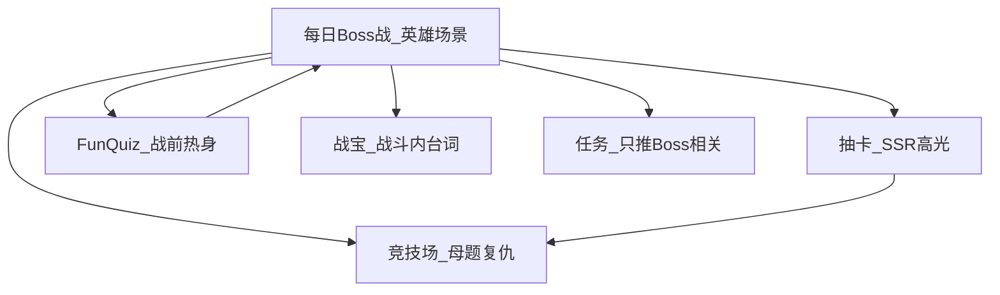

# 《学霸天天战》小学生向产品升级策略 — PM 沉淀

> **读者**：产品经理、运营、设计、研发、教研协作方  
> **版本**：2026-05-28（含最小闭环与包 A 落地）  
> **方法论总纲**：[PM-儿童教育游戏化方法论.md](./PM-儿童教育游戏化方法论.md)（建议先读：公式、红线、排期、体验包）  
> **前置文档**：[PM-酷感传播升级沉淀.md](./PM-酷感传播升级沉淀.md)（问题诊断、首版三周节奏、小程序踩坑）  
> **母题类型命名**：[PM-母题类型Boss命名.md](./PM-母题类型Boss命名.md)（题型驱动外号、双名体系、A1/A3、最小闭环）  
> **关联 PRD**：[xueba-tiantian-zhan-prd.md](../src/imports/pasted_text/xueba-tiantian-zhan-prd.md)  
> **Boss 美术 Prompt**：[boss-ai-prompts.md](./boss-ai-prompts.md)

---

## 一、文档定位：从「能玩」到「愿天天玩、愿晒、记得住母题」

[酷感传播首版](./PM-酷感传播升级沉淀.md) 解决了「像作业不像游戏」的根因，并完成 Boss 战、海报、班级 MVP 等落地。  
本文档回答下一阶段：**如何让 2～4 年级孩子觉得更酷、更好玩、学得更牢、更有辨识度、更愿意在班级群传播。**

**核心判断（经验沉淀）**：

| 误区 | 正解 |
|------|------|
| 功能越多越酷 | 酷 = **3 秒看懂 + 30 秒有爽感 + 结束有可晒物** |
| 加题量提升教育效果 | **3 题强反馈 + 母题记忆** > 30 题平淡刷题 |
| 传播靠运营口号 | 传播靠 **海报图 + 同学接力挑战**，不是弹窗文案 |
| 宠物/任务/竞技场各推一条线 | 全模块 **服务「今日 Boss 战」英雄场景**，不抢戏 |

**北极星（不变）**：

> 每天 5 分钟，用一道母题打败今日 Boss，把战绩晒到班里。

**目标用户**：小学 **2～4 年级**（认字有限、单环 &lt; 30 秒、强视觉弱文字）。

---

## 二、现状快照（2026-05）

### 2.1 已落地能力

| 能力 | 孩子视角 | 关键路径 |
|------|----------|----------|
| 每日 Boss 战（3 题 + 血条 + 必杀） | 「我在打怪」 | `src/pages/DailyChallengePage` |
| 战绩海报 + 首次分享 +5 金币 | 有东西可发群 | `src/utils/sharePoster.ts` |
| 战宝 IP + 学霸力 + 卡牌去教务化 | 语言像游戏 | `src/constants/theme.ts` |
| 班级周榜 + 12 格领地 + 班级码 | 集体归属 | `src/pages/ClassroomPage` |
| 竞技场母题属性卡攻 +10% | 学完能复仇 | `src/pages/ArenaPage` |
| Gate → Boss → 主世界 | 先学后玩 | `DailyGatePage` → `DailyChallengePage` → `MainWorldPage` |

### 2.2 P0 主链路手感（近期已做）

| 项 | 说明 | 路径 |
|----|------|------|
| 招式化反馈 | 答对显示「除法斩！」「连击除！」等 | `getMoveName` in `src/data/dailyBoss.ts` |
| 战宝统一 | Gate / Boss 战 / 结算共用 `MascotBubble` | `src/components/MascotBubble` |
| Boss 动效 | idle 浮动、受击闪白、招式飘字 | `src/components/BossBattle/BossHeader.tsx` |
| 音效包 | 默认静音，战斗页可切换 | `src/utils/sfx.ts`、`npm run gen:sfx` |
| Gate 预告 | Boss 立绘 + 大号母题 + 挑衅语 | `src/pages/DailyGatePage` |

### 2.3 仍待补齐的 gap

1. **爽感密度**：连击 UI、弱点条视觉化、Boss APNG 循环动画（prompt 见 [boss-ai-prompts.md](./boss-ai-prompts.md)）  
2. **教育闭环**：错题 → 明日热身、通关后「教战宝」、Boss 图鉴  
3. **传播飞轮**：班级数据仍为 mock；缺分享深链与异步 PK  
4. **模块认知**：任务/宠物/错题本仍像「功能清单」，未完全「Boss 化」

---

## 三、五维升级框架


---

## 四、更酷：英雄场景 = 每日仪式

### 4.1 情绪曲线（目标）


### 4.2 体验增强清单

| 优先级 | 方案 | 状态 | 说明 |
|--------|------|------|------|
| P0 | Boss 会动（APNG/GIF idle） | **部分已做** | 组件已支持 APNG 自动探测；放入 `*_idle.apng` 即生效，无则 CSS 呼吸 |
| P0 | 音效包（可关） | **已做** | 课堂场景务必默认静音 |
| P0 | Gate「通缉令」预告 | **已做** | 今日外号 + 母题类型 + 例题（见母题类型命名文档） |
| P1 | 连击 UI | **已做** | 2 连击 / 3 连击，与第 3 题必杀联动 |
| P1 | 招式化反馈 | **已做** | 继续按 `knowledgeTag` 扩展文案 |
| P2 | 弱点条 | **已做** | 答错 +1 弱点，同题再答伤害 +20%，弱点再打一拳 |

### 4.3 PM 红线（与首版文档一致）

- 不新增 5 个以上独立页面  
- 不做长剧情、开放世界跑图  
- 不把「酷」建立在加题量  

---

## 五、更好玩：模块「服务 Boss」，不抢戏



| 模块 | 改造策略 | 孩子话术 |
|------|----------|----------|
| **竞技场** | 固定「用今日卡牌复仇」；战后展示母题加成伤害 | 「闪电加加今天特别猛」 |
| **抽卡** | 新卡匹配今日 `knowledgeTag` 时提示「明日 Boss 可能怕这张」 | 制造次日回访 |
| **战宝** | 战斗内 `MascotBubble` 随机鼓励，不单独推宠物页 | 陪伴不分散 |
| **任务中心** | 首屏仅 3 条：完成 Boss / 分享海报 / 班级贡献；其余折叠 | 减少作业清单感 |
| **错题本** | 订正 1 题 = Boss 弱点研究 +5 学霸力 | 错题变「研究 Boss」 |
| **FunQuiz** | 入口文案「Boss 战前热身」 | 服务主链路 |

### 5.1 新玩法：异步 Boss PK（P1，低成本）

- **不做**实时对战（合规 + 研发成本高）  
- **做法**：同班/好友比较「今日同一 Boss 通关秒数 + 答对数」  
- **入口**：海报底部「挑战我」→ 分享带 `bossKey` + `duration`  
- **落地**：直达 `DailyChallengePage`，结算显示「你比 TA 快 8 秒」

---

## 六、教育效果更好：从「做对题」到「记住母题」

### 6.1 「每日一母题」三段式（差异化核心）

| 环节 | `stage` | 教育设计 | 产品表现 |
|------|---------|----------|----------|
| 第 1 题 | `review` | 激活旧知 | 「复习一击」 |
| 第 2 题 | `learn` | 母题变式 | 「弱点试探」 |
| 第 3 题 | `boss` | 应用题情境 | 「母题必杀」+ 海报「今日母题：84÷7」 |

**经验**：家长看海报认母题；孩子记 **Boss 名 + 母题**，不记抽象知识点编号。

### 6.2 教育闭环（建议 P0～P1）

1. **错题 → 明日热身（间隔重复）**  
   - `StorageManager` 记录错题 `knowledgeTag`  
   - `FunQuizPage` / Gate 优先 1 道昨日错题变式  
   - 文案：「战宝：昨天 Boss 的陷阱，今天先练练！」

2. **通关后「教战宝」**（费曼极简版，约 10 秒）  
   - 一屏选择题：「用一句话教战宝怎么算 84÷7」  
   - 预设选项（非自由输入，适配低年级）  
   - 选对 +5 学霸力；选错展示标准句式  

3. **Boss 图鉴**（个人页内嵌，非新 tab）  
   - 除法史莱姆 / 乘法石怪 / 应用题巨龙  
   - 每击败一次点亮；同类型 7 次 → 「黄金 Boss」边框  

4. **教研绑定（P2，需内容输入）**  
   - Boss 轮换对齐校内章节（人教/北师大可选）  
   - 配置仍走 `src/data/dailyBoss.ts` 或按周 JSON  

### 6.3 家长信任

- 海报保留母题一行（传播 + 教研双需求）  
- 个人页只展示学习向数据，不展示纯战力排行（符合 PRD）  
- P2：周报小程序卡片（本周击败 Boss 数 + 母题列表，视觉与海报一致）

---

## 七、更具特色：「母题日报」品类心智

| 维度 | 作业 App | 纯游戏 | 学霸天天战（目标） |
|------|----------|--------|---------------------|
| 打开第一句 | 今日练习 | 开玩 | **今日 Boss 是谁** |
| 学习单元 | 章节题海 | 无 | **一道母题打穿** |
| 社交单位 | 排行榜 | 好友 PK | **班级 Boss 击败数** |
| 传播物 | 分数截图 | 皮肤 | **通缉令式战绩海报** |
| 商业 | 会员题库 | 氪金 | **零氪 + 学玩分离** |

### 7.1 IP 三板斧（持续投入 &gt; 堆功能）

1. **战宝**：Gate / 战斗气泡 / 海报角标固定出场  
2. **三 Boss 轮换**：除法史莱姆、乘法石怪、应用题巨龙（长期可出贴纸/表情）  
3. **卡牌名**：闪电加加、乘法忍者等，与 `CARD_KNOWLEDGE_TAGS`、Boss 属性一致  

**对外一句话（运营/家校）**：

> 「我们班今天在打除法史莱姆，84÷7 母题日报。」

---

## 八、传播效果：从「能分享」到「同学接力」

### 8.1 传播飞轮

```mermaid
flowchart TD
  clear[通关Boss] --> poster[生成海报]
  poster --> share[分享班级群]
  share --> click[同学点击挑战我]
  click --> clear2[同学通关]
  clear2 --> rank[班级周榜加1]
  rank --> notify[班级页刚击败滚动]
  notify --> clear
```

### 8.2 环节对照

| 环节 | 当前 | 下一版 |
|------|------|--------|
| 海报 | Canvas PNG 已上线 | 加小程序码/班级码、「挑战我」深链 |
| 班级榜 | mock「全班仅 N 人通关」 | 后端真实班级通关人数 |
| 归因 | 无 | 分享带 `classId`，统计分享带来的通关 |
| 社交证明 | 弱 | 班级页「刚刚击败 Boss」滚动 3 条 |

### 8.3 传播文案库（2～4 年级，短句）

| 场景 | 文案示例 |
|------|----------|
| 海报标题 | 「我 23 秒击败除法史莱姆！」 |
| 海报副标题 | 「今日母题 84÷7 · 三年级2班」 |
| 分享按钮 | 「敢不敢挑战我？」 |
| 班级页 | 「我们班本周已击败 Boss 47 次，再 3 次点亮下一格领地！」 |
| Gate | 「今日通缉：除法史莱姆 · 母题 84÷7」 |

### 8.4 裂变克制（家长信任底线）

- 仅战绩对比、班级荣誉；不做邀请返现、不做战力榜  
- 分享奖励保持轻量（首次 +5 金币合理）  
- 海报必须保留母题一行  

---

## 九、四周实施节奏

| 周次 | 主题 | 交付项 | 后端依赖 |
|------|------|--------|----------|
| 第 1 周 | 爽感密度 | Boss APNG、连击 UI、Gate 通缉令 framing、战宝战斗台词扩展 | 无 |
| 第 2 周 | 教育闭环 | 错题→明日热身、教战宝一屏、Boss 图鉴 | 无（本地存储） |
| 第 3 周 | 传播真数据 | 班级真实通关、分享深链、异步 PK、海报小程序码 | **需要** |
| 第 4 周 | 验证调优 | 5 人儿童访谈、漏斗指标复盘、P2 立项决策 | 视数据 |

**第 1 周部分项已完成**（音效、招式名、MascotBubble、Gate 预告、Boss 受击动效），剩余以 APNG + 连击 UI 为主。

---

## 十、成功指标

| 指标 | 目标 | 说明 |
|------|------|------|
| Gate → Boss 通关率 | ≥ 70% | 漏斗第一刀 |
| 结算页分享点击率 | ≥ 15% | 有海报后再测 |
| 次日留存 | 较基线 +10% | 本地对比即可 |
| 「教战宝」完成率 | ≥ 50% | 教育深度代理指标 |
| 定性 | 孩子用「打 Boss」描述产品 | 5 人访谈 |

**不建议早期盯**：DAU 暴增、付费 ARPU（与 PRD 冲突）。

---

## 十一、PM 优化经验沉淀（可复用到其他儿童教育产品）

> 完整方法论（公式、排期、体验包、决策时间线）见 [PM-儿童教育游戏化方法论.md](./PM-儿童教育游戏化方法论.md)。

### 11.1 儿童「酷」的公式

```
酷感 = 身份认同（我在打谁）× 即时反馈（数字/震动/动画）× 社交货币（可晒物）
```

每一环缺失都会导致「功能很多却不酷」。

### 11.2 低年级的认知约束

- **认字量有限**：按钮 &lt; 6 字；说明用图标 + 1 句  
- **耐心窗口短**：单环 &lt; 30 秒；多一步注册/规则说明即流失  
- **错答心理**：用「Boss 弱点提示」替代红叉羞辱  
- **峰值设计**：第 3 题「母题必杀」必须是全屏 1s 峰值，否则没有「赢了一局」感  

### 11.3 学玩分离的产品技巧

- **Gate 强制先学**：未完成 Boss 不进主世界（已实现）  
- **主世界所有玩法绑定今日母题**：竞技场 +10%、抽卡 tag 提示  
- **家长看到的传播物含母题**：海报底部一行是信任锚点  

### 11.4 传播设计技巧

- **图 &gt; 字**：1500×2400 海报比弹窗分享转化高一个量级  
- **班级群是天然渠道**：微信班级群 &gt; 好友 graph；班级码 + 周榜比个人榜更正向  
- **异步 PK &gt; 实时对战**：低龄 + 合规 + MVP 成本的最优解  
- **mock 数据要限期替换**：「全班仅 N 人通关」mock 久了会伤信任  

### 11.5 研发协作（小程序特有，详见首版文档第八章）

- 微信 **不支持 SVG**，Boss 立绘必须 PNG（`npm run gen:boss-png`）  
- 图片路径用 `../../assets/...`，勿用 `/assets/...`（会 500）  
- Canvas 海报用 `type="2d"`，结算后 delay 再绘制  
- 音效默认静音，尊重课堂场景  

### 11.6 决策一句话

> **不要再加第五个系统；把「每日 Boss 战」做成有动画、有声音、有连击、有教战宝的 5 分钟仪式，用真实班级数据 + 挑战深链让海报变成同学接力赛，用母题日报 + 战宝 IP 与家长信任拉开与作业 App、纯游戏的距离。**

---

## 十二、会议话术

| 对象 | 话术 |
|------|------|
| **老板** | 下一阶段不是加功能，是把 Boss 战做成每日仪式，并用班级真实数据让海报变成同学接力赛。 |
| **研发** | 优先连击 UI、教战宝、分享深链；其它模块只接 Boss，不新开系统。 |
| **设计** | Boss APNG + 连击数字 + 海报「挑战我」按钮，比十张通用插画更值。 |
| **运营** | 传播抓手是「母题日报」海报 + 「敢不敢挑战我」，不是活动规则长文。 |
| **教研** | 三段式题组（复习→变式→应用）+ 教战宝预设句，需教研审核母题与选项。 |

---

## 十三、关键文件索引

| 领域 | 路径 |
|------|------|
| Boss 题组/人设/招式名 | `src/data/dailyBoss.ts` |
| 母题类型外号词库 | `src/data/bossNicknames.json` |
| A3 外号批量脚本 | `scripts/generate_boss_nicknames.py` |
| 母题类型命名 PM 文档 | `docs/PM-母题类型Boss命名.md` |
| 立绘与路径 | `src/utils/bossAssets.ts` |
| 血条与动效 | `src/components/BossBattle/BossHeader.tsx` |
| 战宝气泡 | `src/components/MascotBubble/index.tsx` |
| 闯关主流程 | `src/pages/DailyChallengePage/index.tsx` |
| 入门 Gate | `src/pages/DailyGatePage/index.tsx` |
| 音效 | `src/utils/sfx.ts` |
| 分享海报 | `src/utils/sharePoster.ts` |
| IP 常量 | `src/constants/theme.ts` |
| 班级 | `src/pages/ClassroomPage/index.tsx` |
| 进度/错题 | `src/utils/storage.ts` |
| Boss 美术 Prompt | `docs/boss-ai-prompts.md` |
| 首版酷感沉淀 | `docs/PM-酷感传播升级沉淀.md` |

---

## 修订记录

| 日期 | 修订内容 |
|------|----------|
| 2026-05-27 | 首版：五维升级框架、四周节奏、教育闭环、传播飞轮、PM 经验沉淀；对齐 P0 主链路已落地项 |
| 2026-05-28 | 包 A 状态更新；链至方法论总纲 |
