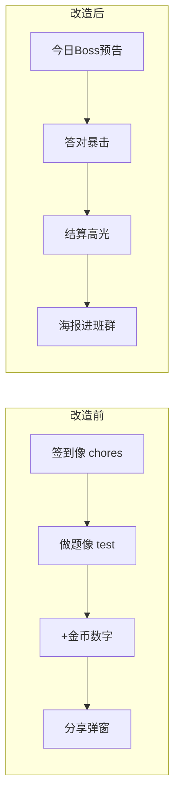
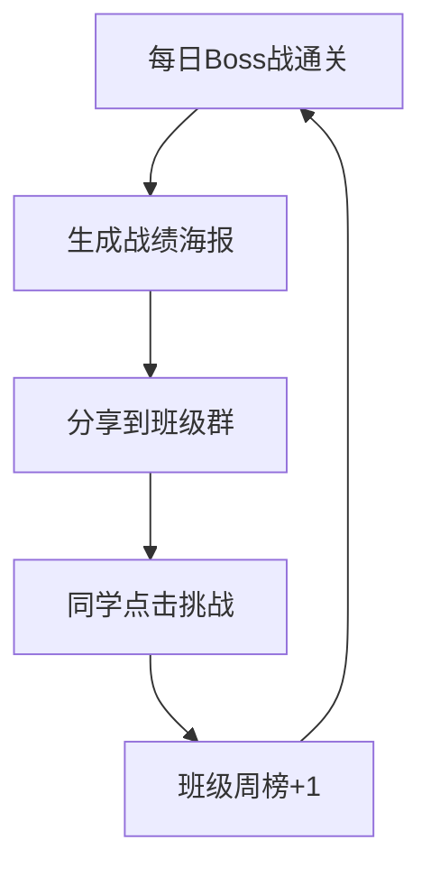

# 《学霸天天战》酷感与传播升级 — 产品沉淀文档

> **读者**：产品经理、运营、设计、研发协作方  
> **版本**：2026-05（基于 V1.0 小程序 MVP 的一次迭代）  
> **方法论总纲**：[PM-儿童教育游戏化方法论.md](./PM-儿童教育游戏化方法论.md)（酷感公式、排期原则、命名纠正、体验包 ABC）  
> **关联 PRD**：[xueba-tiantian-zhan-prd.md](../src/imports/pasted_text/xueba-tiantian-zhan-prd.md)  
> **关联实现**：README「酷感与传播升级」章节

---

## 一、背景：为什么「功能很多却不酷」

### 1.1 现象

研发侧已具备：每日闯关、卡牌、竞技场、宠物、班级、段位、任务、签到等模块。  
但产品负责人与内测反馈集中在：

- 「像作业 App，不像游戏」
- 「不想继续做下去」
- 「孩子不会主动分享到班级群」

### 1.2 根因（产品判断，非缺功能）

| 孩子心里的「酷」 | 当时产品给的感受 |
|----------------|------------------|
| 我在打 Boss | 「小怪 A」+ 白底选择题 |
| 我抽到 SSR 了 | 「加法小师」+ 数字 +12 |
| 我们班赢了 | 班级页偏演示，无集体目标 |
| 发群里显摆 | 弹窗拼字，没有「可晒的东西」 |

**结论**：酷 ≠ 功能多；酷 = **3 秒看懂 + 30 秒有爽感 + 结束后有东西可发**。

### 1.3 与 PRD 的关系

PRD 强调「学玩分离、教育优先、无氪金」。本次升级**不推翻** PRD，而是：

- **学**：仍绑定每日闯关完成（先学后玩）
- **酷**：把「每日闯关」做成唯一**英雄场景**
- **传播**：每次通关产出可转发物，而不是运营口号

---

## 二、北极星（2～4 年级）

**一句话**：每天 5 分钟，用一道母题打败今日 Boss，把战绩晒到班里。

| 维度 | 定义 |
|------|------|
| 核心用户 | 小学 2～4 年级（认字量有限，需要强视觉、短句） |
| 英雄场景 | 每日 Boss 战（全产品只推这一条主链路） |
| 传播物 | 战绩海报（图 > 字） |
| 集体动机 | 班级 Boss 击败周榜 + 领地格子（归属感） |
| 不做 | 充值、战力掠夺、复杂剧情、再堆 5 个以上新页面 |

---

## 三、情绪曲线：改造前后

**产品原则**：每一环尽量在 **30 秒内**完成；多一步「注册/解释规则」都会杀死低年级传播。

---

## 四、三周迭代节奏（可复用模板）

### 第 1 周：英雄场景 —「真打怪」

**目标**：不改题量与母题逻辑，只改**呈现与反馈**。

| 要素 | 做法 | 验收（定性） |
|------|------|--------------|
| Boss 身份 | 除法史莱姆 / 乘法石怪 / 应用题巨龙，按日轮换 + 一句挑衅 | 8～10 岁孩子 10 秒内能说出「我在打谁」 |
| 答对 = 攻击 | 伤害数字、血条下降、轻震动 | 有「我在打」而非「我在选」 |
| 答错 | 「Boss 弱点提示」，避免红叉羞辱 | 错后愿继续，不摔手机 |
| 第 3 题 | 「母题必杀」全屏 1s → 结算 | 有「赢了一局」的峰值 |

**研发映射**：`src/data/dailyBoss.ts`、`BossHeader`、`DailyChallengePage`

---

### 第 2 周：传播 —「战绩海报」

**目标**：从「分享按钮」变成「分享物」。

| 要素 | 做法 |
|------|------|
| 海报内容 | Boss 立绘、答对 x/3、秒数、母题一行、段位、班级钩子文案 |
| 技术形态 | Canvas 2D 导出 1500×2400 PNG；`onShareAppMessage` 带 title + imageUrl |
| 激励 | 首次分享当日 +5 金币（轻量，不破坏教育形象） |
| 文案钩子 | 「全班仅 N 人今日通关」（可先 mock，后续接真实班级数据） |

**验收**：孩子愿主动点分享；家长愿转发（海报上有「今日母题：84÷7」）。

**研发映射**：`src/utils/sharePoster.ts`、`StorageManager.claimDailyShareReward`

---

### 第 3 周：IP + 班级理由

**IP（先统一 3 屏，不全站重绘）**

| 原教务感 | 建议（2～4 年级） |
|----------|-------------------|
| 5 分钟数学闯关 | 今日 Boss 战 |
| 知识点 +12 | 学霸力 +12 |
| 加法小师 | 闪电加加 / 乘法忍者等 |
| 分散 emoji | 固定 mascot「战宝」贯穿 Gate / 闯关 / 结算 |

**班级（MVP 可本地，结构预留后端）**

- 周榜：本周班级「Boss 击败数」
- 领地：通关一次点亮 1 格（共 12 格）
- 同班：班级码加入（分享带 classId 为后续项）

**仪式感**：通关后「校园大门已打开」toast，呼应 PRD「先学后玩再进主世界」。

---

## 五、传播飞轮（机制，不是 slogan）

**PM 注意**：飞轮每一环都要有**可见反馈**；仅有「分享统计字段」没有「海报图」等于没飞轮。

---

## 六、现有模块怎么「服务英雄场景」（不重做）

| 模块 | 策略 | 原因 |
|------|------|------|
| 竞技场 | 「用今日卡牌复仇」+ 母题属性卡攻 +10% | 复用已有 900+ 行对战逻辑，不抢 Boss 戏 |
| 抽卡 | 动画 1.5s + SSR 全屏 2s | 低成本高光 |
| 宠物 | 闯关时战宝喊「暴击」，不单独推 | 避免功能分散 |
| FunQuiz | 入口改为「Boss 战前热身」 | 消化隐藏页面，服务主链路 |
| 错题本/校长室 | 主世界「展开更多」，不抢首屏 | 控制认知负荷 |

---

## 七、成功指标建议

| 指标 | 目标 | 说明 |
|------|------|------|
| 首日完成 Boss 战率 | ≥ 70% | Gate → 闯关漏斗 |
| 结算页分享点击率 | ≥ 15% | 有海报后再看 |
| 次日留存 | 较基线 +10% | 本地对比即可 |
| 定性 | 孩子用「打 Boss」描述产品 | 访谈 5 人即可 |

**不建议早期盯**： DAU 暴增、付费 ARPU（与 PRD 定位冲突）。

---

## 八、研发协作：小程序特有坑（PM 必知）

以下问题在本次迭代中**真实发生**，写入文档避免后人重复踩坑。

### 8.1 图片格式

| 问题 | 现象 | 处理 |
|------|------|------|
| SVG 立绘 | `getImageInfo:fail file not found` | 微信 Image / Canvas **不支持 SVG**，必须 PNG |
| 生成方式 | 设计给 SVG 源文件 | `npm run gen:boss-png`（`scripts/svg-to-png.mjs`） |

### 8.2 图片路径（极易踩坑）

| 写法 | 实际请求路径 | 结果 |
|------|--------------|------|
| `/assets/bosses/xxx.png` 或页面内 `../../assets/...` 字符串 | `pages/当前页/assets/...` | **500** |
| `bossAssets.ts` 内 `import png from '...'`（webpack 打包） | 项目根 `assets/bosses/...` | **正确**（与卡牌立绘一致） |

**PM 验收清单**：开发者工具 Network 里图片 URL **不能**包含 `pages/DailyChallengePage/assets`。

**静态资源构建**：`gen:boss-png` 生成 PNG；编码后 **必须** 执行 `npm run rebuild:weapp`（见 [dev-build-checklist.md](./dev-build-checklist.md)）。

### 8.4 导入与 app.json（研发必知）

| 现象 | 处理 |
|------|------|
| `app.json is not found` | 多非未编译，而是 `miniprogramRoot` 或导入目录错误 |
| 推荐导入 | **直接打开 `dist/` 文件夹** |
| `miniprogramRoot: "./"` in dist | 构建后由脚本删除；勿手写 |

详见 **[微信小程序开发踩坑与方法论.md](./微信小程序开发踩坑与方法论.md)** §三。

### 8.3 Canvas 海报

| 问题 | 处理 |
|------|------|
| 旧版 canvas 警告 | 改用 `type="2d"` + `getContext('2d')` |
| 节点未挂载就绘制 | 结算后 delay 300ms 再 `generatePoster` |
| 分享无图 | 必须 `useShareAppMessage` 返回 `imageUrl`（临时文件路径） |

---

## 九、明确不做的事（防止再次「不酷」）

1. **不堆新页面** — 先提高主链路密度  
2. **不做充值 / 掠夺榜** — 家长信任与 PRD 底线  
3. **不做长剧情** — 一个 Boss、一张海报、一个班级目标足够验证  
4. **不靠加题量变酷** — 3 题强反馈 > 30 题平淡  
5. **不把「酷」建立在纯文案** — 要有立绘、血条、海报图  

---

## 十、后续迭代优先级（给下一任 PM）

> **下一阶段完整方案**见 [PM-小学生产品升级策略.md](./PM-小学生产品升级策略.md)（五维框架、教育闭环、四周节奏、PM 经验沉淀）。

### P0（有后端后再做）

- 班级周榜**真实数据**（替换 mock「全班仅 N 人通关」）
- 分享带 `classId` / 邀请归因
- 海报小程序码（需后台生成或固定运营码）

### P1（体验加深）

- Boss 立绘换专业美术（仍走 PNG 管线）
- 音效：答对暴击、SSR、Boss 出场（注意课堂场景音量）
- 每日 Boss 与教材章节/校内进度绑定（需教研输入）

### P2（验证传播后再扩）

- 好友 PK（仅战绩对比，非实时对战，降低研发与合规成本）
- 家长端极简报告（海报同款信息 + 学习时长）

---

## 十一、会议话术 / 对齐用

**对老板**：我们不是加功能，是把「每日闯关」做成孩子愿意炫耀的一局游戏，并用班级榜拉动二次打开。

**对研发**：优先 Boss 战手感 + 海报 + 图片路径，其它模块只接母题加成，不新开系统。

**对设计**：一套 Boss 立绘（512 PNG）+ 一张海报模板（750×1200 逻辑尺寸）比十张通用插画更值。

**对运营**：传播抓手是「我 X 秒击败了除法史莱姆」海报，不是活动规则说明。

**对教研**：海报底部保留「今日母题：84÷7」一行，兼顾传播与家长信任。

---

## 十二、关键文件索引（方便交叉查阅）

| 领域 | 路径 |
|------|------|
| Boss 题组与人设 | `src/data/dailyBoss.ts` |
| 立绘与路径 | `src/utils/bossAssets.ts` |
| 血条 UI | `src/components/BossBattle/BossHeader.tsx` |
| 闯关主流程 | `src/pages/DailyChallengePage/index.tsx` |
| 入门 Gate | `src/pages/DailyGatePage/index.tsx` |
| 分享海报 | `src/utils/sharePoster.ts` |
| IP 常量 | `src/constants/theme.ts` |
| 班级周榜 | `src/pages/ClassroomPage/index.tsx` |
| 进度存储 | `src/utils/storage.ts` |
| PNG 生成脚本 | `scripts/svg-to-png.mjs` |
| 构建 copy | `config/index.ts` → `copy.patterns` |

---

## 十三、心理建设（给产品负责人）

若你觉得「不想继续做」，常见原因不是方向错了，而是**自己打开的是自检清单视角**（功能列表、数据字段），不是**孩子视角**（我今天要赢、要晒）。

本次迭代的核心赌注是：

> **把竞技场已有的「对战手感」搬回每日闯关，再用一张海报解决传播。**

比从零做一个新系统，成功率更高，也更符合 MVP 资源。

---

## 修订记录

| 日期 | 修订内容 |
|------|----------|
| 2026-05-26 | 首版：酷感传播方案落地总结 + 微信小程序图片/Canvas 踩坑沉淀 |
| 2026-05-27 | 第十章增加指向 [PM-小学生产品升级策略.md](./PM-小学生产品升级策略.md) 的交叉引用 |
| 2026-05-28 | 增加指向 [PM-儿童教育游戏化方法论.md](./PM-儿童教育游戏化方法论.md) 总纲链接 |
