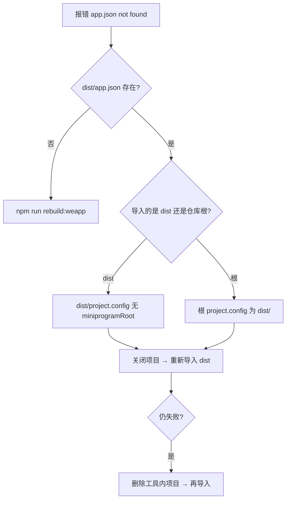

# 微信小程序开发踩坑与方法论

本文沉淀 **学霸天天战** 项目在 Taro 4 + 微信开发者工具联调中的真实问题、排查路径与工程约定。面向研发、AI 协作与 PM 验收。

**相关文档**：[dev-build-checklist.md](./dev-build-checklist.md)（日常命令清单）· [PM-酷感传播升级沉淀.md](./PM-酷感传播升级沉淀.md)（产品向踩坑摘要）

---

## 一、核心原则（先记住这 5 条）

| # | 原则 | 说明 |
|---|------|------|
| 1 | **只编到 `dist/`** | Taro `outputRoot: dist`，不维护 `miniprogram/` 等第二份副本 |
| 2 | **改码后全量重建** | 默认 `npm run rebuild:weapp`，避免过期 chunk / 缺 PNG |
| 3 | **导入前先验证** | `dist/app.json` 必须存在（`npm run verify:dist`） |
| 4 | **`project.config` 分场景** | 导入 `dist/` 与导入仓库根的 `miniprogramRoot` **不能混用** |
| 5 | **立绘用 PNG + webpack import** | 微信不支持 SVG 立绘；Boss 资源与卡牌一致走 `import` |

---

## 二、构建与目录方法论

### 2.1 编译产物唯一真相：`dist/`

```
src/          ← 源码（React + Taro）
config/       ← Taro 配置（outputRoot: dist）
dist/         ← 微信可读的小程序（app.json、pages、assets…）
```

| 命令 | 作用 |
|------|------|
| `npm run dev:weapp` | `gen:assets` + watch 编译到 `dist/` |
| `npm run build:weapp` | 增量编译 + `verify:dist` + `sync:project-config` |
| `npm run rebuild:weapp` | **删 `dist` 后全量构建**（编码结束默认） |
| `npm run fix:weapp` | 同 `rebuild:weapp`（排错入口） |

### 2.2 为何不复制一份 `miniprogram/`？

曾尝试：`dist` → 同步到 `miniprogram/`，根目录 `miniprogramRoot: miniprogram/`。

| 做法 | 问题 |
|------|------|
| 双目录 | 与 Taro 惯例不符，易问「build 到哪了」；多一份拷贝增加心智负担 |
| 结论 | **已废弃**；只保留 `dist/`，用正确的 `project.config` 即可 |

### 2.3 自动化脚本职责

| 脚本 | 时机 | 职责 |
|------|------|------|
| `scripts/svg-to-png.mjs` | `gen:boss-png` | SVG → PNG，并写入 `src` 与 `dist/assets/bosses` |
| `scripts/verify-dist.mjs` | 每次 build 后 | 断言 `dist/app.json` 存在 |
| `scripts/sync-project-config.mjs` | 每次 build 后 | 修正根目录 / dist 的 `project.config.json` |

---

## 三、`app.json is not found` 方法论（重点）

### 3.1 现象

```
[ app.json 文件内容错误] app.json: app.json is not found in the project root directory
```

**不等于** 没编译成功，多数是 **开发者工具在错误目录找 `app.json`**。

### 3.2 根因分类

| 类型 | 典型原因 |
|------|----------|
| A. 未编译 / 编译中 | `rebuild` 已 `rm -rf dist`，尚未生成 `app.json` |
| B. 导入目录错误 | 打开了 `src/` 或空目录 |
| C. `miniprogramRoot` 错误 | 见下表 |
| D. 工具改写配置 | 导入后删掉 `miniprogramRoot` 或改成 `./` |
| E. 项目缓存 | 旧项目未删除，仍用错误配置 |

### 3.3 `miniprogramRoot` 对照表（本项目约定）

| 导入目录 | 使用的配置文件 | `miniprogramRoot` 应为 |
|----------|----------------|-------------------------|
| **`dist/`（推荐）** | `dist/project.config.json` | **无此字段**（不要 `./`、`dist/`） |
| 仓库根 | 根目录 `project.config.json` | **`"dist/"`** |

**错误示例（本次真实踩坑）**：

```json
// dist/project.config.json — Taro 默认会写入，需构建后删除
"miniprogramRoot": "./"
```

在部分微信开发者工具版本（如 2.01.x）中，`./` 会导致在错误路径解析，即使 `dist/app.json` 存在仍报错。

**修复**：`npm run sync:project-config` 会从 `dist/project.config.json` **删除** `miniprogramRoot`；根目录写回 `"dist/"`。

### 3.4 标准排查流程（5 步）



1. `npm run fix:weapp` → 看到 `verify-dist` OK、`sync-project-config` OK  
2. 确认 `dist/app.json` 存在  
3. 微信工具 **关闭/删除** 旧项目  
4. **重新导入** `…/xuebatiantianzhan/dist`（推荐）  
5. 检查 `dist/project.config.json`：无 `miniprogramRoot`；根目录则为 `dist/`

### 3.5 验收命令

```bash
# 应有输出
test -f dist/app.json && echo OK app.json

# dist 内不应出现 miniprogramRoot（导入 dist 时）
grep miniprogramRoot dist/project.config.json && echo 需执行 sync || echo OK dist 配置

# 根目录应为 dist/
grep miniprogramRoot project.config.json
```

---

## 四、静态资源（Boss 立绘）方法论

### 4.1 格式

| 格式 | 微信 Image / getImageInfo | 本项目 |
|------|---------------------------|--------|
| SVG | ❌ 不支持 | 仅作设计源文件 |
| PNG | ✅ | `npm run gen:boss-png` 生成 |
| APNG | ✅（需文件真实存在） | 未入库前 **不要** 探测 |

### 4.2 引用方式演进

| 阶段 | 写法 | 结果 |
|------|------|------|
| 早期 | 页面内 `../../assets/bosses/xxx.png` 字符串 | 易解析到 `pages/当前页/assets/...` → 500 |
| 当前 | `bossAssets.ts` 内 `import png from '...'` | webpack 输出 `assets/bosses/...`，与卡牌一致 ✅ |

### 4.3 APNG 探测原则

- **有文件 + 在 `BOSS_IDLE_APNG_SRC` 注册** → 才 `getImageInfo` 探测  
- **无文件** → 直接用 PNG + CSS 呼吸动效，避免控制台 `MiniProgramError`

### 4.4 PM / 测试验收

Network 中 Boss、战宝图片 URL：

- ✅ `…/assets/bosses/portraits/division_slime.png`  
- ❌ 含 `pages/DailyChallengePage/assets/`

---

## 五、微信开发者工具使用约定

| 项 | 建议 |
|----|------|
| 导入目录 | **优先 `dist/`** |
| 基础库 | 灰度 3.15.0 提示可忽略；异常时可切 3.4.x 稳定版 |
| 编译时机 | `rebuild` 过程中勿刷新工具（`dist` 会被清空） |
| 配置被改 | 执行 `npm run sync:project-config` 或 `rebuild:weapp` |

---

## 六、AI / 协作交付检查单

完成小程序相关改动后，在回复中应说明：

- [ ] 已执行 `npm run rebuild:weapp`（或说明为何仅 watch）  
- [ ] `dist/app.json` 存在  
- [ ] 已跑 `sync:project-config`（build 链会自动跑）  
- [ ] 若动 Boss SVG：已 `gen:boss-png`  
- [ ] 告知导入方式：**推荐 `dist/`**  

---

## 七、问题 → 动作速查

| 现象 | 优先动作 |
|------|----------|
| `app.json is not found` | `fix:weapp` → 重导入 **`dist/`** → 查 `miniprogramRoot` |
| `getImageInfo:fail file not found` | `gen:boss-png` + `rebuild:weapp`；查 Network 路径 |
| 图片 500，`pages/.../assets/` | 改为 webpack `import`，勿用页面相对字符串 |
| `dist` 里又出现 `miniprogramRoot: "./"` | `npm run sync:project-config` |
| 不知道 build 到哪 | **只有 `dist/`** |

---

## 八、文档维护

| 变更类型 | 更新位置 |
|----------|----------|
| 新增 npm 脚本 / 构建链 | 本文 §2、§7 + [dev-build-checklist.md](./dev-build-checklist.md) |
| 新的微信踩坑 | 本文 §3 / §4 + [PM-酷感传播升级沉淀.md](./PM-酷感传播升级沉淀.md) §八 |
| 产品验收项 | PM 文档 §8.2 |

*最后更新：2026-05-28（app.json / miniprogramRoot / Boss PNG 联调沉淀）*
